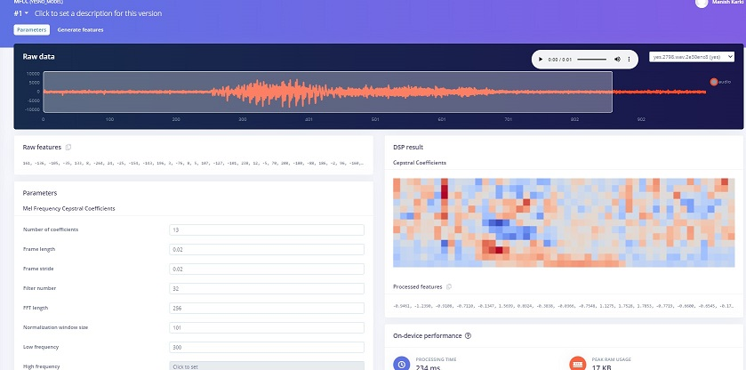
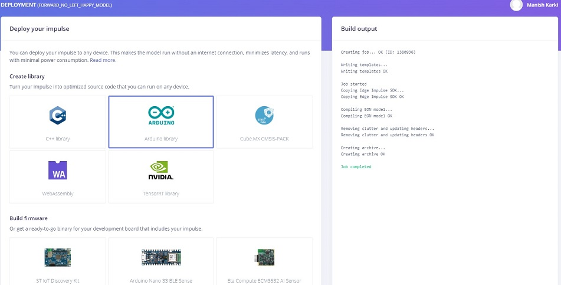

# Speech Recognition on Kørsel

This repository contains the source code and models used for the speech recognition implemented on a Korsel robot. 
 

## Description of the project

This project intends to provide a simple ML algorithms for speech recognition. The main task is to modify the Kørsel project and make a small robot with the capability of speech recognition. 
We perform different experiment to build a tflite model using different architecture until the sufficient classification accuracies of speech control is achieved.
The trained models are deployed in the robot (Kørsel) controlled by Arduino Nano 33 BLE Sense and observe the performances on the real environment.

Kørsel is a simple line tracking robot developed at the University of Applied Sciences Ravensburg Weingarten in the Faculty of Electrical Engineering and Computer Science. It is controlled by a Arduino nano and
has a CNY70 sensor which detects either the black line or the bright/white background. It drives in a zigzag way around tracking line detecting the background color. 

Arduino Nano 33 BLE Sense is used as the microcontroller in the robot since it has the feature to create ML modules using Tensorflow Lite.
Edge impluse is used as the development flatform. Loading the sample data, pre-processing them, extracting the features, building the neural architecture for model training, model testing
and building the model .zip file, all are performed in edge impluse.      

## Repository Content

* **data/_custom_noise:** - it contains the custom motor noise datasets. This is the noise produced by motor when the robot is in driving on the trackline and is collected using mobile phone.
* **images/** - a few images related to the project.
* **models/** - all the trained models for differents experiments performed.
* **src/** - contains the scripts written in the Arduino IDE to support the project.  

## Data Collection and Processing
We used the Google Speech Commands dataset which has 65,000 one-second long utterances of sets of thirty short words. This can be obtained from the link [here](http://download.tensorflow.org/data/speech_commands_v0.02.tar.gz). 
In additon to these samples, we have also collected some custom background noise of the the robot using mobile phone. This can be found in the data/_custom_noise folder in our repository.

The source code and the instruction of data curation can be found in the link [here](https://github.com/memanish008/ei-keyword-spotting). 

## Feature extraction
It is the process of identifying those components from audio signals that are good in identifying the linguistic content discarding the unnecessary factors like noise. Audio MFCC fature extraction is suited for the human voice.

## Model Training
After the data are processed, We train a classifier model with different model architecture in edge impluse. When the training is done, we will see the Model panel at the right side of the page. While starting the training 20% of the data is used for the validation.
Also, we use an early stopping startegy on the validation dataset. Data augmentation is also performed while training the models in oder to create an robust models by generating a comprehensive set of data. 

## Model Testing
The trained model is evaluated on the test dataset. A confusion mattrix is taken in consideration to comapre the testing accuracy of different classes.

## Deployment of the model
We can deploy the model back to our device. This makes the model run without internet connection, minimizes latency, and runs with minimum power consumption. Edge impluse can package up the complete impulse in a single arduino library. 
The process to deploy the model in nano 33 is
* Download the built .zip Arduino library
* In Arduino IDE from sketch toolbar select the Include library and add this .zip file
* From the File option select examples and then open the model with the filename “nano_ble33_sense_microphone_continuous”
* make the required modification in the sketch to control the robot and then upload the sketch to the nano 33

All these trained models with the modification can be found in the models folder here in our repository. 

## Experiments

A series of experiments were performed using differnt neural architecture to obtain the best model for speech recognition. This includes the whole process of data processing, impulse creating, training and building the model, and deploying it on the robot and observing the model performances on real environment.
In general, we train and build a classifer model for the target voice command. Then while deploying the model some changes are made in the scripts. This includes catching the target voice commands predicted by the model and defining its function to control the robot. For our case, controlling the robot is 
enabling and disabling the motor on the robot, changing the PWM value to control the driving speed of the robot, and blinking different color LEDs for different target voice commands.        

The videos of the testing the Kørsel robot performance on the track line using different trained models are available in the Google Drive link [here](https://drive.google.com/drive/folders/1pUV_IysSdNKn0U_R8hXAS0FiaRnUzW44?usp=sharing).
